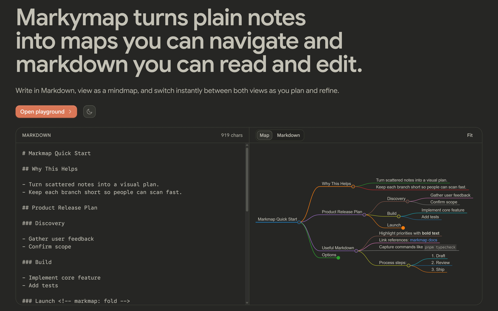

# Markymap — Markdown to Mindmap

Turn your thoughts into beautiful, interactive mindmaps. Write in Markdown, visualize instantly, and never lose your work.

**Live Demo:** [markymap.vercel.app](https://markymap.vercel.app/)

---

## What Is Markymap?

Markymap is a modern, high-performance web application that converts Markdown into interactive, zoomable, pannable mindmaps. It solves three critical problems with existing mindmap tools:

1. **Your work is never lost** — Auto-saves to browser storage, so you can close the tab and pick up exactly where you left off.
2. **Easy collaboration & sharing** — Export your mindmap and re-import it anytime. Share your `.md` files and let others edit them visually.
3. **Pure Markdown workflow** — No proprietary formats. Write clean Markdown, and Markymap handles the visualization.

Perfect for brainstorming, planning projects, learning new topics, or documenting ideas in a way that's both visual and text-based.

---

## Features

- **Live Markdown Editor** — Write Markdown on the left, see your mindmap update in real-time on the right
- **Interactive Mindmap** — Zoom, pan, collapse/expand branches with smooth animations
- **Dark & Light Modes** — Built-in theme toggle with keyboard shortcut (`d` key) and persistent preferences
- **Sound Design** — Click feedback and theme-switch sounds (optional, fully accessible)
- **Local Persistence** — Your work auto-saves to `localStorage` — no account needed, no data sent anywhere
- **Import & Export** — Download your mindmap as Markdown, import it back, or share the file with others
- **Mobile-Friendly** — Fully responsive design from desktop to mobile

---

## Tech Stack

**Framework & Language:**

- [Next.js 16](https://nextjs.org/) — Modern React framework with App Router
- [React 19](https://react.dev/) — Latest React with improved performance and APIs
- [TypeScript 6](https://www.typescriptlang.org/) — Strict type safety across the codebase

**Styling & UI:**

- [Tailwind CSS v4](https://tailwindcss.com/) — Utility-first CSS with design tokens system
- [coss UI](https://github.com/coss-ui) — Base UI component library, 51+ components pre-configured

**Mindmap & Data:**

- [markmap-lib](https://markmap.js.org/) — Transforms Markdown into mindmap data structures
- [markmap-view](https://markmap.js.org/) — Renders interactive SVG mindmaps with zoom/pan

**Icons & Design:**

- [Hugeicons](https://hugeicons.com/) — Professional icon library
- [Web Audio API](https://developer.mozilla.org/en-US/docs/Web/API/Web_Audio_API) — High-performance sound system

**Developer Tools:**

- [pnpm](https://pnpm.io/) — Fast, disk-space efficient package manager
- [Oxlint](https://oxc-project.github.io/) — Lightning-fast linter
- [Oxfmt](https://oxc-project.github.io/) — Consistent code formatter

---

## Quick Start

### Prerequisites

- Node.js 18+ (20+ recommended)
- pnpm 8+

### Installation

```bash
# Clone the repository
git clone https://github.com/yourusername/markymap.git
cd markymap

# Install dependencies
pnpm install

# Start development server
pnpm dev
```

Open [http://localhost:3000](http://localhost:3000) in your browser. The app includes:

- **Home** (`/`) — Interactive hero demo of the mindmap
- **Playground** (`/playground`) — Full editor with Markdown input, live preview, and controls

### Build for Production

```bash
pnpm build
pnpm start
```

---

## Quality Assurance

Before committing code, run:

```bash
# Type checking
pnpm typecheck

# Linting
pnpm lint

# Format checking (or auto-format with `pnpm fmt`)
pnpm fmt:check
```

**Note:** `components/ui/` is excluded from linting to preserve upstream compatibility with the coss library.

---

## Project Structure

```
markymap/
├── app/                          # Next.js App Router
│   ├── globals.css              # Design tokens, motion utilities, theme
│   ├── layout.tsx               # Root layout, theme provider, fonts
│   ├── (marketing)/             # Landing page route
│   │   ├── page.tsx             # Hero + live demo
│   │   └── ui/                  # Marketing-specific components
│   └── (playground)/
│       └── playground/
│           └── page.tsx         # Mindmap editor route
├── components/                   # React components
│   ├── editor/                  # Editor-specific components
│   │   ├── editor-shell.tsx     # Editor container & state
│   │   ├── markdown-input.tsx   # Markdown textarea
│   │   ├── markmap-canvas.tsx   # Mindmap SVG renderer
│   │   └── ...                  # Other editor features
│   ├── theme-provider.tsx       # Theme + sound system setup
│   └── ui/                      # coss UI components (51+)
├── hooks/                        # React hooks
│   ├── use-sound.ts             # Audio playback hook
│   ├── use-hover-capability.ts  # Pointer capability detection
│   ├── use-media-query.ts       # Responsive design helper
│   └── ...
├── lib/                         # Utilities & helpers
│   ├── audio/                   # Web Audio API sound engine
│   ├── markmap-*.ts             # Markmap integration & options
│   ├── storage.ts               # localStorage management
│   └── utils.ts                 # `cn()` class merging utility
├── public/                      # Static assets
│   ├── fonts/                   # Local font files (Google Sans)
│   └── marketing-image.jpg      # Marketing banner image
├── spec/                        # Documentation & specs
│   ├── context.md               # Project memory & architecture
│   ├── markmap-packages/        # Detailed markmap API docs
│   ├── landing-page/            # Landing page wireframes
│   └── ...
├── package.json                 # Dependencies & scripts
├── tsconfig.json                # TypeScript config (strict mode)
├── tailwind.config.ts           # Tailwind CSS config
└── AGENTS.md                    # AI agent & developer quick reference
```

---

## Development Philosophy

### Core Principles

- **Server Components First** — React Server Components where possible; `"use client"` only where needed
- **No Inline Styles** — Use Tailwind CSS utilities via `cn()` from `lib/utils.ts`
- **Accessible by Default** — Full keyboard support, WCAG AA compliance, screen reader friendly
- **Performance Matters** — Lazy loading, code-splitting, optimized animations, Web Audio over `<audio>` elements
- **Type Safety** — TypeScript strict mode, no `any`, exhaustive checks

### Key Conventions

| Concern           | Standard                                                      |
| ----------------- | ------------------------------------------------------------- |
| **File naming**   | `kebab-case` for all files and directories                    |
| **Class merging** | Always use `cn()` — never string-concatenate Tailwind classes |
| **Icons**         | Hugeicons only; never import from lucide-react                |
| **UI Components** | coss UI components (`components/ui/`) — do not recreate       |
| **Module system** | ES modules (ESM) — Next.js handles the rest                   |

### Audio System

The app uses Web Audio API for high-performance sound:

- Sounds are pre-decoded and cached (no latency on play)
- Autoplay-policy compliant (plays after first user interaction)
- Global click sounds delegated from `ThemeProvider`
- Use `useSound()` hook in components; opt-out with `data-click-sound="off"`

---

## Customization

### Adding Your Own Sounds

1. Encode audio to base64: `node encode-base64.js my-sound.wav`
2. Create a new module in `lib/audio/` (e.g., `lib/audio/my-sound.ts`)
3. Export the data URI and import it in `components/theme-provider.tsx`

### Changing Colors & Theme

All colors are defined as CSS variables in `app/globals.css`:

- Light mode: `:root { --primary: ... }`
- Dark mode: `.dark { --primary: ... }`

Update these variables to rebrand the entire app instantly.

### Disabling Sounds

Set `NEXT_PUBLIC_SOUNDS_ENABLED=false` in `.env.local` to disable all audio.

---

## Deployment

Markymap is optimized for [Vercel](https://vercel.com/), but works on any Node.js host:

```bash
# Vercel (automatic)
git push origin main
# → Auto-deploys from GitHub

# Self-hosted
pnpm build
pnpm start
# → Runs on port 3000 by default
```

Environment variables:

- `NEXT_PUBLIC_SOUNDS_ENABLED` — Enable/disable audio (default: `true`)

---

## Browser Support

- **Desktop:** Chrome 90+, Firefox 88+, Safari 14+, Edge 90+
- **Mobile:** iOS Safari 14+, Chrome Android 90+

Requires support for:

- ES2020+ JavaScript
- Web Audio API (for sounds)
- CSS custom properties (design tokens)
- `prefers-color-scheme` media query (theme detection)

---

## Contributing

This project welcomes forks and contributions. Before submitting a PR:

1. Read `AGENTS.md` for project conventions
2. Read `spec/context.md` for architecture details
3. Run `pnpm lint && pnpm typecheck && pnpm fmt:check` — all must pass
4. Keep changes focused and well-tested

Key areas for contribution:

- AI-powered mindmap generation (route handler needed)
- Advanced map controls (collapse, focus, filters)
- Export formats (PDF, PNG, SVG)
- Collaborative editing (WebSocket + auth)

---

## License

[MIT](LICENSE) — Feel free to use, modify, and sell. Attribution appreciated but not required.

---

## Support & Feedback

- **Issues:** [GitHub Issues](https://github.com/yourusername/markymap/issues)
- **Discussions:** [GitHub Discussions](https://github.com/yourusername/markymap/discussions)
- **Live Demo:** [markymap.vercel.app](https://markymap.vercel.app/)

---

**Built with ❤️ using Next.js, React, and Tailwind CSS.**
