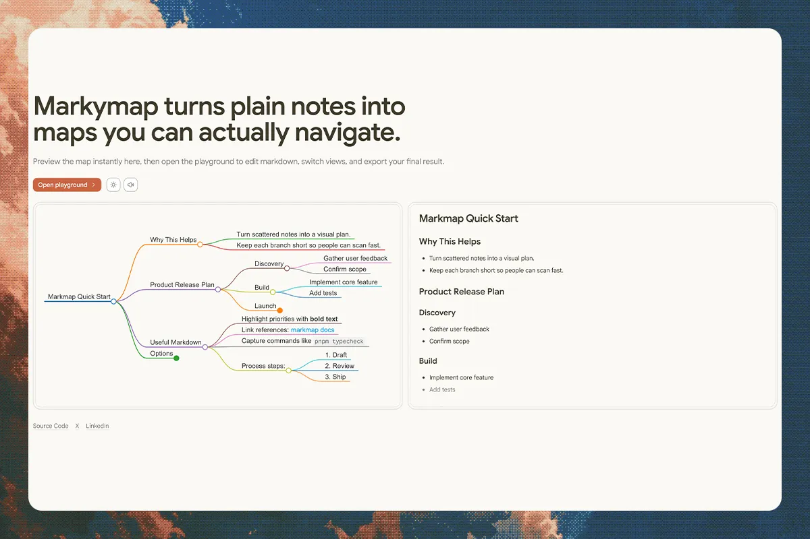

# Markymap

Markymap turns Markdown into interactive mindmaps in the browser. Write or import structured notes, see the map update as you work, and export the result when it is ready.

It is a local-first Next.js application for visual thinking, outlining, planning, and Markdown-based authoring. The public homepage includes a live preview, while the playground provides the full editing workflow.

## What you can do

- Write Markdown and render it as a zoomable, pannable SVG mindmap.
- Switch between the mindmap and a rendered Markdown preview.
- Save editor content, view preferences, map options, and fold state in `localStorage`.
- Import Markdown files or Markymap JSON project bundles.
- Export Markdown, JSON project bundles, map HTML, and Markdown PDFs.
- Collapse and expand branches, fit or reset the map view, and configure map behavior.
- Use light/dark themes and optional interaction sounds.
- Try the live homepage demo without opening the editor.

## Routes

| Route         | Purpose                                                                         |
| ------------- | ------------------------------------------------------------------------------- |
| `/`           | Marketing homepage with a live Markdown and mindmap preview                     |
| `/playground` | Full editor for writing, previewing, configuring, importing, and exporting maps |

## Current status

The core homepage and playground workflows are implemented and actively maintained. The repository does not currently include the planned AI assistant integration.

## How it works

Markymap uses `markmap-lib` to transform Markdown into a node tree and `markmap-view` to render that tree as an interactive SVG. The playground keeps editing state in the browser, updates the map as Markdown changes, and preserves relevant preferences between sessions.

Exports are generated through dedicated server routes. The map HTML export preserves the map and its configured options, while Markdown PDF export renders the formatted document for printing.

## Run locally

### Requirements

- Node.js compatible with the installed Next.js version
- pnpm

Install dependencies and start the development server:

```bash
pnpm install
pnpm dev
```

Open [http://localhost:3000](http://localhost:3000) for the homepage or [http://localhost:3000/playground](http://localhost:3000/playground) for the editor.

### Environment variables

Copy `.env.example` to `.env.local` when you want to configure the site URL:

```env
NEXT_PUBLIC_SITE_URL=http://localhost:3000
```

The site URL is used by metadata, generated social images, `robots.txt`, and `sitemap.xml`. Interaction sounds are enabled by default unless the user disables them in the interface.

## Commands

```bash
pnpm dev          # Start the Turbopack development server
pnpm build        # Create a production build
pnpm start        # Serve the production build
pnpm typecheck    # Run TypeScript without emitting files
pnpm lint         # Run Oxlint
pnpm fmt:check    # Check Oxfmt formatting
pnpm test         # Run the Vitest test suite
```

## Project structure

```text
app/              App Router pages, layouts, metadata, and export routes
components/editor Editor shell, Markdown input, previews, and map controls
components/ui/   Coss/Base UI component snapshots
hooks/            Reusable React hooks
lib/              Storage, Markmap transformation, export, audio, and utilities
public/           Static branding assets
spec/             Product context, architecture notes, and implementation specs
```

## Technology

- Next.js 16 App Router
- React 19 and TypeScript in strict mode
- Tailwind CSS v4
- Coss UI components built on Base UI
- Markmap (`markmap-lib` and `markmap-view`)
- Hugeicons
- Web Audio API for optional interaction sounds
- Oxlint, Oxfmt, and Vitest

## Documentation

- [`AGENTS.md`](AGENTS.md) — repository conventions and development workflow
- [`spec/context.md`](spec/context.md) — current product context and implementation history
- [`spec/skills.md`](spec/skills.md) — project skill index and task-routing guidance
- [`spec/markmap-packages/`](spec/markmap-packages/) — Markmap integration and feature specifications
- [`spec/styling.md`](spec/styling.md) — UI tokens and styling guidance

## Design and contribution notes

The application uses Coss UI primitives from `components/ui/`, Tailwind design tokens, and Hugeicons. New feature code should compose with those existing systems, use `cn()` from `lib/utils.ts` for class merging, and avoid inline styles.

Before submitting a change, run the relevant typecheck, lint, formatting, and test commands. Keep product behavior and implementation claims in this README aligned with the current codebase.
